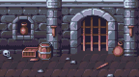

# remap

## Description

`remap` allows you to remap the colors of an image to a limited set of colors specified by your palette using [libimagequant](https://github.com/lovell/libimagequant). Supported palette formats are Act, Microsoft Pal, JASC, GIMP, Paint .NET and png.

## Installation

```bash
git clone https://github.com/bernhardfritz/remap.git
cd remap
mkdir build
cd build
cmake ..
make
make install
```

## Usage

```
remap [options] <inputFilename> <paletteFilename> <outputFilename>
```

## Options

| option          | alias             | description     |
| --------------- | ----------------- | --------------- |
| `-r min-max`    | `--range min-max` | Use a range of colors from the palette |
| `-b 4\|8`        | `--bits 4\|8`      | Bit depth of png output (default 8) |
| `-s n\|auto`     | `--slot n\|auto`   | 16 color palette slot |
| `-m`            | `--mask`          | Generate a mask file |

## Example

```bash
remap dungeon.png endesga-32-1x.png output.png
```




## References

* [color-diff](https://github.com/markusn/color-diff)
* [libimagequant](https://github.com/lovell/libimagequant)